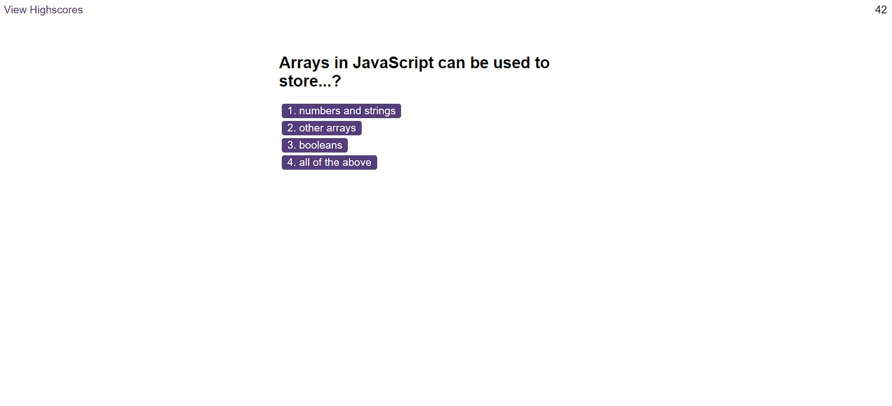

# JavaScript-browser-quiz
A timed quiz on JavaScript fundamentals that stores high scores.

## Description
This project creates a timed coding quiz with multiple-choice questions. This app will run in the browser, and features dynamically updated HTML and CSS powered by JavaScript.

High scores are stored locally so that progress can be gauged or compared with other local users.

The following shows the web application's appearance and functionality:
 

 

The application:

* Presents a start button that when clicked, starts a timer and the first question appears.

* Questions contain buttons for each answer.
  
* When an answer is clicked, correct/incorrect status appears and the next question is presented.
  
* If the answer clicked was incorrect, then 10 seconds is subtracted from the time remaining
  
* The quiz ends when all questions are answered, or the timer reaches 0.

* When the game ends, it displays a users score and gives the ability to save user initials along with their score.

* Users score and initials are saved to local High Score storage and can be accesed through the application UI
  

## Table of Contents

- [Installation](#installation)
- [Usage](#usage)
- [Credits](#credits)
- [License](#license)

## Installation

N/A

## Usage
No special usage instructions. 

Intuitive button to start quiz. Each choice presented is a click-button for the answer to each question. When a choice is clicked, the UI displays if answer was correct or incorrect. Quiz finishes and displays high scores. User adds their intials, and starts over. High scores stored can be cleared through the application.

 
https://peafunk3000.github.io/JavaScript-browser-quiz/
 

The repository for this project can be found on my GitHub:
 
https://github.com/PeaFunk3000/JavaScript-browser-quiz/
 

## Credits

N/A

## License

MIT License

